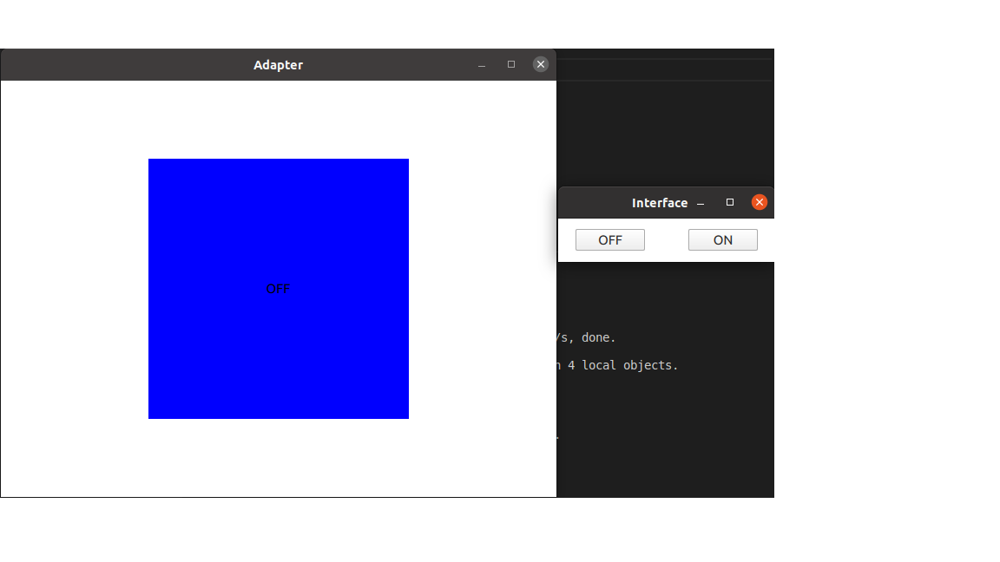

# D-Bus Native project
>This project demonstates how to write a native D-Bus in C++ programming language

### What does this project do
* Communication between two application to control the color of rectangle through `On` and `Off` buttons

* Log out the message with logging's severity and the application name
* Redirect the qt logging system to our custom one

## Prerequistes
    * Qt 
    * GNU/C++
## Build and Run process
* Execute  `build.sh` for building and running `run.sh` to observe the interacing between 2 processes